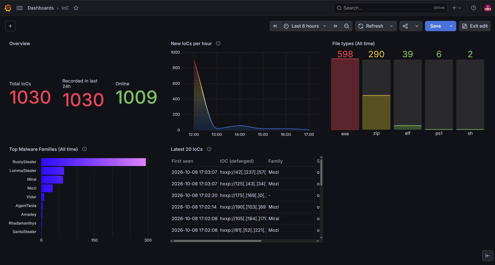
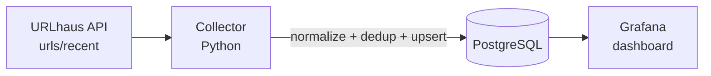

# IOC Pipeline

A small, self-hosted threat intelligence pipeline. It collects recent malicious URLs from the [URLhaus](https://urlhaus.abuse.ch/) feed, normalizes and deduplicates them, stores them in PostgreSQL, and visualizes them in Grafana. Everything runs with Docker Compose.

I built it to practice the core of CTI data engineering: turning a messy public feed into clean, queryable indicators of compromise (IOCs).



## Architecture



| Component | Role |
|---|---|
| `collector.py` | Fetches the feed, normalizes records, deduplicates, upserts into PostgreSQL. Runs once or in a loop. |
| PostgreSQL 16 | Stores IOCs with `first_seen`, `last_seen`, merged `sources` and `tags`. |
| Grafana | Dashboard on top of PostgreSQL (read-only SQL). |

## Features

- **Normalization:** trims whitespace, refangs defanged input (`hxxp://`, `[.]`), validates scheme and host, lowercases only the scheme and host (URL paths are case-sensitive), parses the feed timestamp to UTC, and maps feed fields to one common schema. Invalid records are logged and skipped instead of crashing the run.
- **Two-level deduplication:** in-memory by `(value, ioc_type)` within a batch, and in the database with `UNIQUE (value, ioc_type)` plus `INSERT ... ON CONFLICT DO UPDATE`. On conflict, `first_seen` keeps the earliest value, `last_seen` is refreshed, and `sources` and `tags` are merged.
- **Family extraction:** URLhaus has no family field. Malware family names appear inside `tags`, mixed with file types, hosting platforms and technique names. A curated mapping (`FAMILY_TAGS`) fills the `family` column only from known family tags.
- **Run reporting:** each run logs how many IOCs were new, already existing, dropped as invalid, or duplicated within the batch.
- **Safe display:** the dashboard shows URLs defanged so they cannot be clicked by accident.
- **Tests:** unit tests for normalization, family extraction and in-batch deduplication (`pytest`).

## Data model

```sql
CREATE TABLE IF NOT EXISTS iocs (
  id         SERIAL PRIMARY KEY,
  value      TEXT NOT NULL,
  ioc_type   TEXT NOT NULL CHECK (ioc_type IN ('url','ip','domain','md5','sha1','sha256')),
  sources    TEXT[] NOT NULL,
  family     TEXT,
  status     TEXT,
  tags       TEXT[],
  threat     TEXT,
  first_seen TIMESTAMPTZ NOT NULL DEFAULT now(),
  last_seen  TIMESTAMPTZ NOT NULL DEFAULT now(),
  UNIQUE (value, ioc_type)
);
```

The full schema is in `schema.sql`. The current collector stores IOCs of type `url`; the other types in the `CHECK` constraint are reserved for additional feeds.

## Quick start

**Requirements:** Docker Desktop (Compose v2), and a free abuse.ch Auth-Key from [auth.abuse.ch](https://auth.abuse.ch/). Since 30 June 2025 the URLhaus API requires an `Auth-Key` header.

```bash
git clone https://github.com/<your-account>/ioc-pipeline.git
cd ioc-pipeline
cp .env.example .env        # then edit .env with your own values
docker compose up -d --build
docker compose logs -f collector
```

Open Grafana at <http://localhost:3000> (user `admin`, password from `GRAFANA_PASSWORD`).

1. Add a PostgreSQL data source: host `db:5432`, database `iocdb`, user `ioc` (or a read-only user), TLS mode `disable`. Inside the Compose network the host is the service name `db`, not `localhost`.
2. Import the dashboard from `dashboards/ioc-overview.json` (Dashboards, New, Import) and select that data source.

### Configuration

| Variable | Purpose | Default |
|---|---|---|
| `ABUSECH_KEY` | abuse.ch Auth-Key (required) | none |
| `DB_PASSWORD` | PostgreSQL password (required) | none |
| `GRAFANA_PASSWORD` | Grafana admin password | none |
| `DB_HOST`, `DB_PORT`, `DB_USER`, `DB_NAME` | Database connection | `localhost`, `5432`, `ioc`, `iocdb` |
| `COLLECT_INTERVAL` | Seconds between runs. `0` or unset runs once. | `0` (`900` in Compose) |

`.env` is git-ignored. Never commit real keys or passwords.

### Run the collector locally (without Docker for the collector)

```bash
python -m venv .venv && source .venv/bin/activate    # Windows: .venv\Scripts\activate
pip install -r requirements-dev.txt
docker compose up -d db                              # database only
python -m pytest -q
python collector.py
```

When the collector runs on the host, it connects to `localhost`. Inside Compose it uses `DB_HOST=db`.

## How it works

1. **Fetch:** `GET /v1/urls/recent/` with the `Auth-Key` header and a timeout. 401, 429 and unexpected `query_status` values are handled explicitly.
2. **Normalize:** each record becomes one common dict (`value`, `ioc_type`, `sources`, `family`, `status`, `tags`, `threat`, `first_seen`).
3. **Deduplicate in the batch:** keyed by `(value, ioc_type)`, tags merged.
4. **Upsert:** `INSERT ... ON CONFLICT (value, ioc_type) DO UPDATE`. `RETURNING (xmax = 0)` tells inserts from updates so the run summary is accurate.
5. **Visualize:** Grafana queries PostgreSQL directly.

## Verification checklist

- Run the collector twice in a row: the second run must report `new=0` and only `last_seen` changes.
- Feed the same IOC from two sources: `sources` must contain both.
- Feed an invalid record (URL without host): it is skipped with a log line and the run continues.

## Design decisions

- **Lowercase only host and scheme.** URL paths and queries are case-sensitive, so lowercasing the whole URL would merge distinct indicators.
- **Keep the earliest `first_seen`.** When a second feed is added, the earliest sighting should win.
- **Family only from known family tags.** Generic tags such as `stealer`, `loader` or `rat` describe a type, not a family, so they are deliberately not mapped.
- **Defang only at display time.** Stored values stay usable by tools; the dashboard query defangs them.
- **Plain loop with `sleep` for scheduling.** Simple and enough for a first version.

## Limitations

- **`first_seen` is the feed's timestamp (`date_added`), not the time this pipeline first collected the IOC.** A dashboard panel such as "recorded in last 24h" measures feed activity. A separate `first_collected` column would measure the pipeline.
- **The `recent` endpoint returns a limited number of records per call (about 1000).** If the feed adds more than that between two runs, records are missed. The run interval must stay well below the time span the response covers.
- **Only about half of the records carry a malware family tag.** The rest have an empty `family`. This comes from the source data, not from the pipeline.
- **`status` is a snapshot** of the last value written by the feed and changes over time (online to offline).
- **Single source, single IOC type.** Only URLhaus URLs are stored. The `host` field is not split into separate `ip` or `domain` IOCs yet.
- **A single run that hangs would stall the loop.** Requests have a timeout, but there is no external scheduler or alerting.
- **No data retention policy.** The table grows without a cleanup job.
- **Access control is minimal.** Services bind to `127.0.0.1`; Grafana uses a single admin account.

## Roadmap

- Add feeds such as ThreatFox, MalwareBazaar or OTX (the schema already merges `sources`).
- Split `host` into `ip` and `domain` IOCs.
- Add a `first_collected` column to measure pipeline latency versus feed time.
- Provision the Grafana data source and dashboard from files.
- Add alerting (collector stalled, feed volume anomaly) and a retention job.
- Integration tests against a temporary PostgreSQL container.

## Project structure

```
ioc-pipeline/
├── collector.py             # fetch, normalize, dedup, upsert
├── test_normalize.py        # unit tests
├── schema.sql               # table definition
├── docker-compose.yml       # db, grafana, collector
├── Dockerfile               # collector image
├── requirements.txt         # runtime dependencies
├── requirements-dev.txt     # adds pytest
├── dashboards/
│   └── ioc-overview.json    # exported Grafana dashboard
├── docs/
│   └── dashboard.png        # screenshot used in this README
└── .env.example             # template, no real secrets
```

## Troubleshooting notes

Problems I ran into and how I handled them:

- **401 from the API:** missing or invalid `Auth-Key`. The collector raises a clear error instead of parsing an error page.
- **Grafana cannot reach the database:** inside a container `localhost` is the container itself; use the Compose service name `db`.
- **Changed `DB_PASSWORD` has no effect:** PostgreSQL only reads `POSTGRES_PASSWORD` when it first initializes the volume. Recreate the volume (this deletes data) or change the password with SQL.
- **Port 5432 already in use:** map a different host port, for example `127.0.0.1:5433:5432`, and set `DB_PORT` accordingly.

## Data source and disclaimer

IOC data comes from [URLhaus](https://urlhaus.abuse.ch/) by abuse.ch. Check their terms of use before redistributing data. The URLs in the database point to live malware infrastructure: never open them. This project is for learning and portfolio purposes and has not been hardened for production use.
